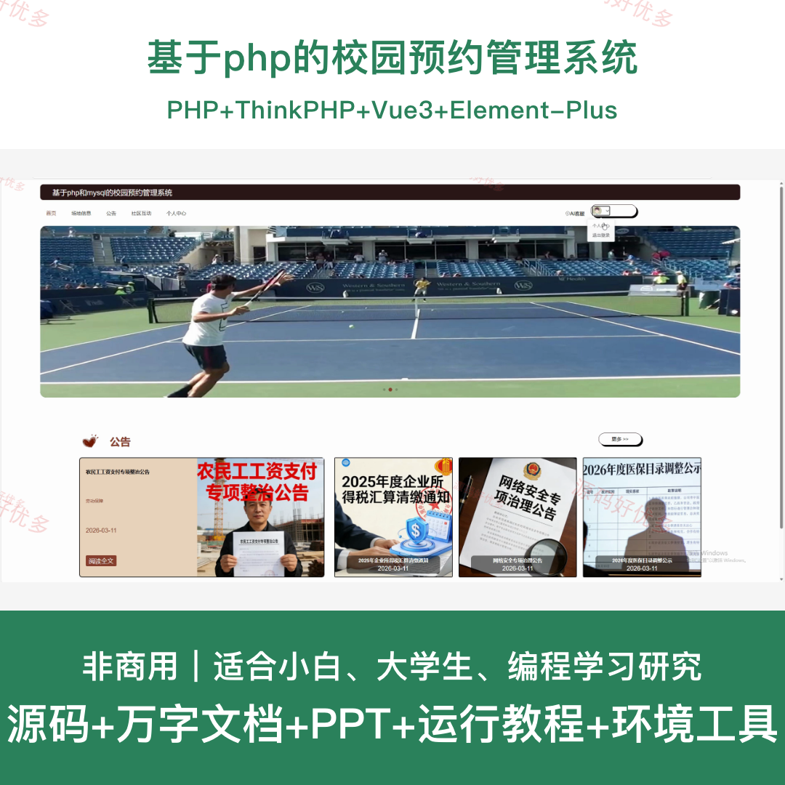
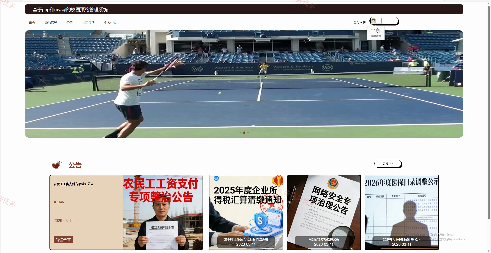
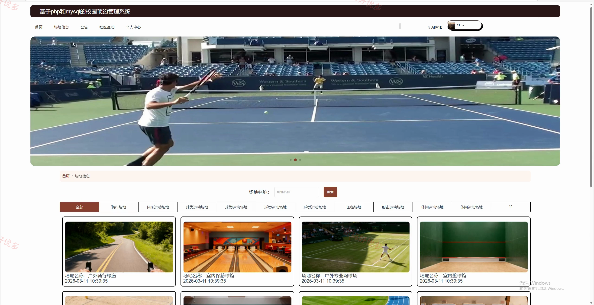
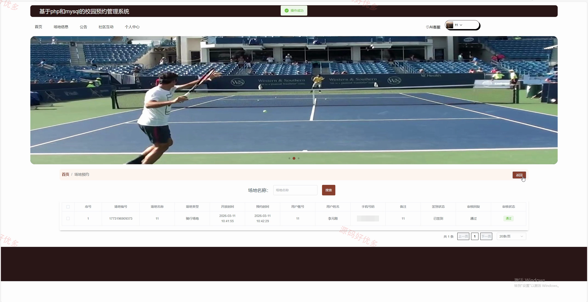
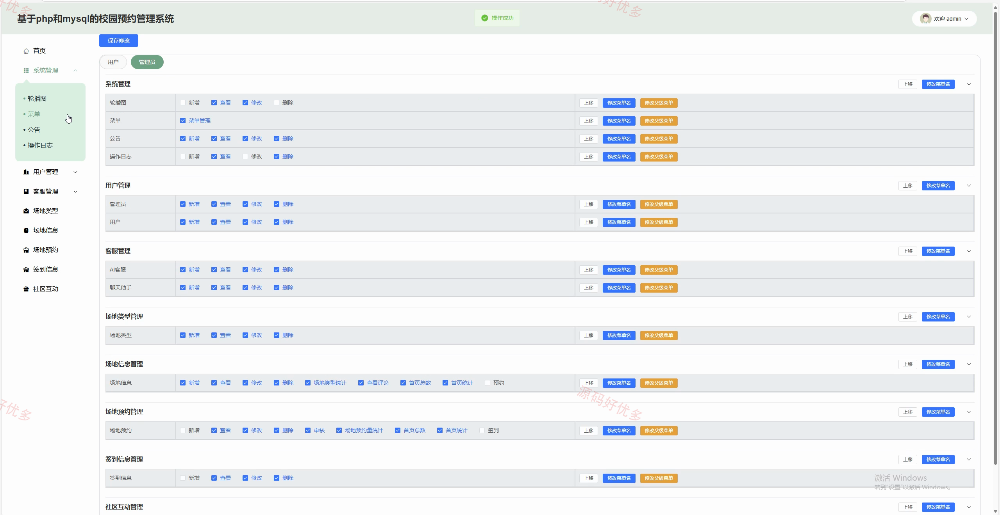
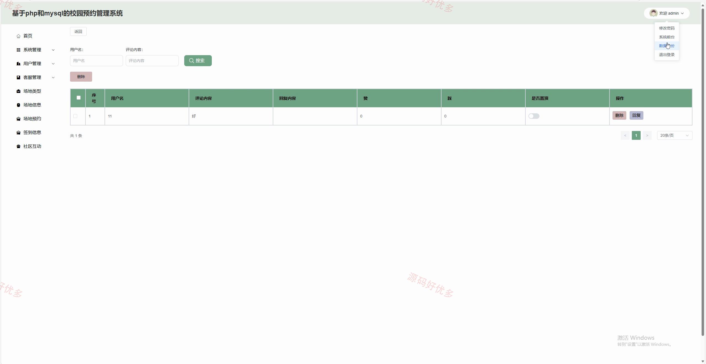
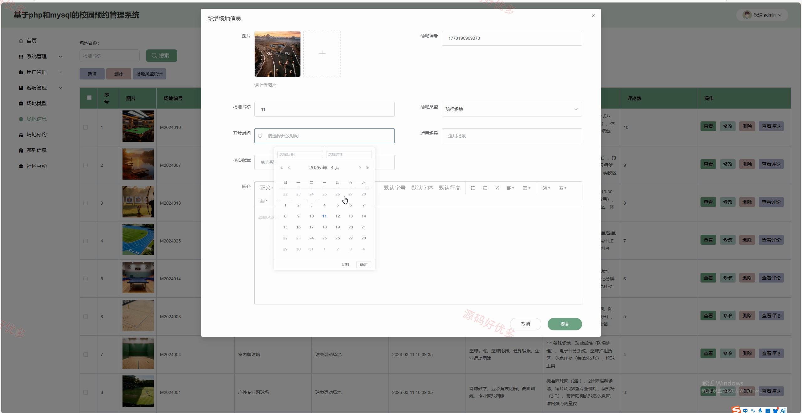
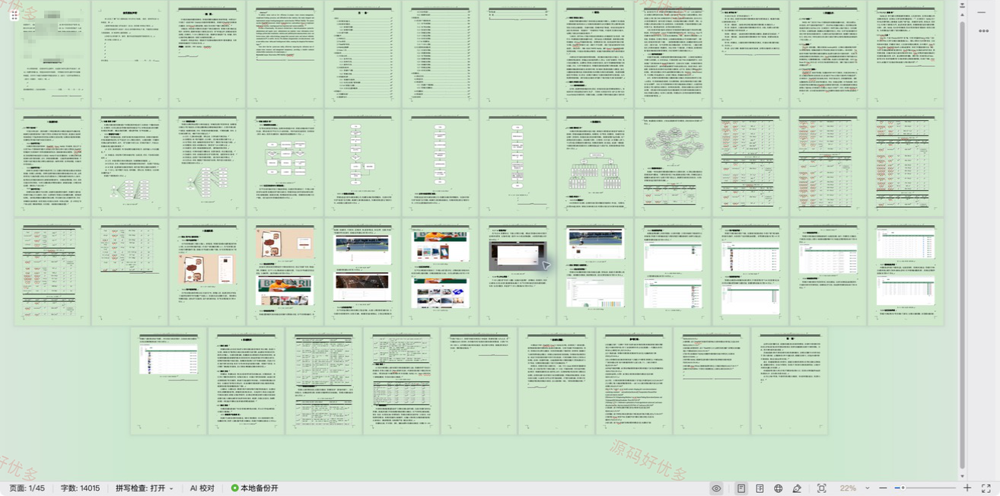

## 源码问题查看主页咨询

### 一、关键词
校园预约管理、校园场地、场地预约、预约签到、社区互动

### 二、作品包含
源码+数据库+万字设计文档+PPT+全套环境和工具资源+本地部署教程

### 三、项目技术
前端技术： Html、Css、Js、Vue3.5、Element-Plus
后端技术：PHP、ThinkPHP

### 四、运行环境（以下版本亲测，其他版本兼容性请自行测试）
开发工具：PhpStorm/VSCODE + VSCODE

数据库：MySQL5.7+（共16张表）

数据库管理工具：Navicat10以上版本

环境配置软件： PHP5.4

前端Nodejs：16+

浏览器：谷歌浏览器

### 五、项目介绍
项目编号：php005

本项目面向校园场地使用与活动预约场景，为用户提供场地信息浏览、在线预约、到场签到、公告查看、社区互动和个人记录管理；管理员负责用户、客服、场地类型、场地资料、预约签到及社区内容的统一维护。

角色：用户、管理员

用户功能：注册登录与个人资料维护、场地信息浏览与评价、场地预约与签到、公告信息查看、社区互动发布与交流、社区互动评价与收藏、我的收藏管理、预约与签到记录管理。

管理员功能：后台登录、系统配置与菜单管理、用户与客服管理、场地类型管理、场地信息与评价管理、场地预约管理、签到信息管理、社区互动与评论管理。

### 六、运行截图

